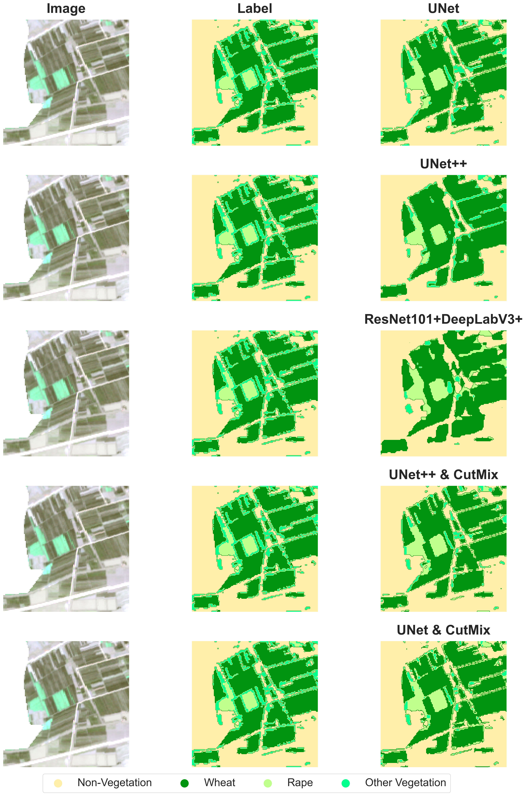

# UNet-Pytorch
        

卫星影像语义分割任务，2023武汉大学Geo-AI大创项目，适用于一切涉及语义分割的课设项目

# Semantic-Segmentation

---

# Environment
* pytorch numpy torchvision matplotlib seaborn tqdm

---

# RGB-NIR
* 使用常见的多光谱遥感影像的RGB+近红外波段，有效提升植被的语义分割精度
* label制作可以参考NDVI结果，使用CVat或者Labelme制作
* NDVI+随机区域生长法也可有效提高label制作效率

---

# Model
### 没有使用内置函数和mmsegmentation等第三方库，为了学习完全手搓
* `FCN + UNet` 经典架构
* `FCN + UNet++`
* `Inceptionv3 + DeeplabV3+`

---

# Loss
### 手搓Dice Loss、 Focal Loss以及混合loss函数

# CutMix混合增强
### 挺好用的一个Trick吧，适用于这种纹理不固定的目标，植被、耕地、湖泊以及一些特殊任务（溢油检测等）
论文放在这里：https://arxiv.org/abs/1905.04899v2

